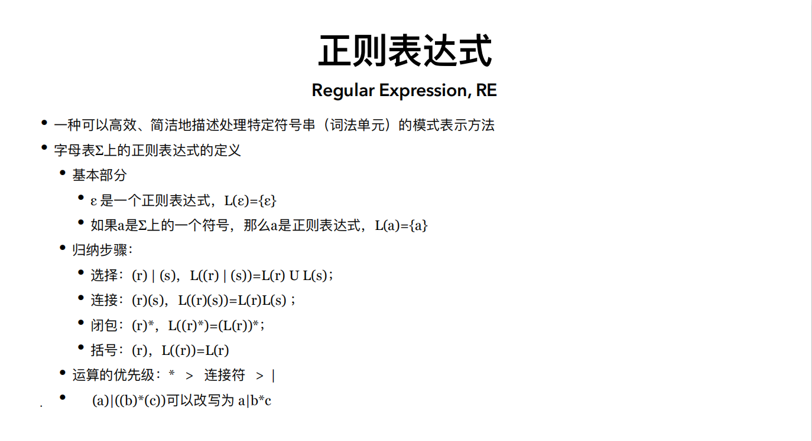
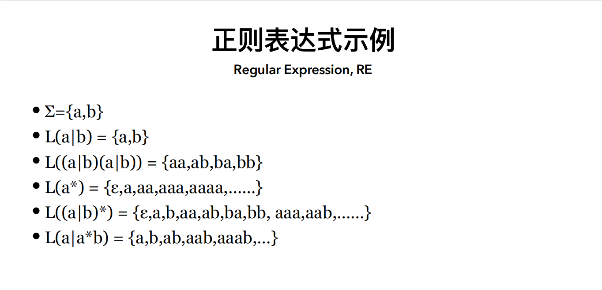
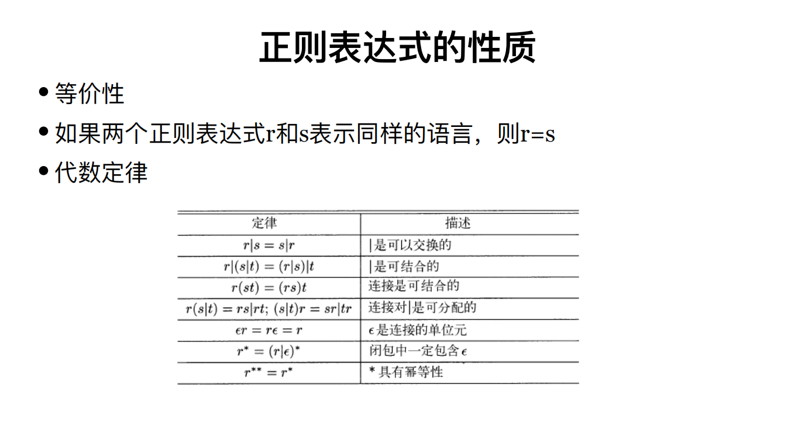
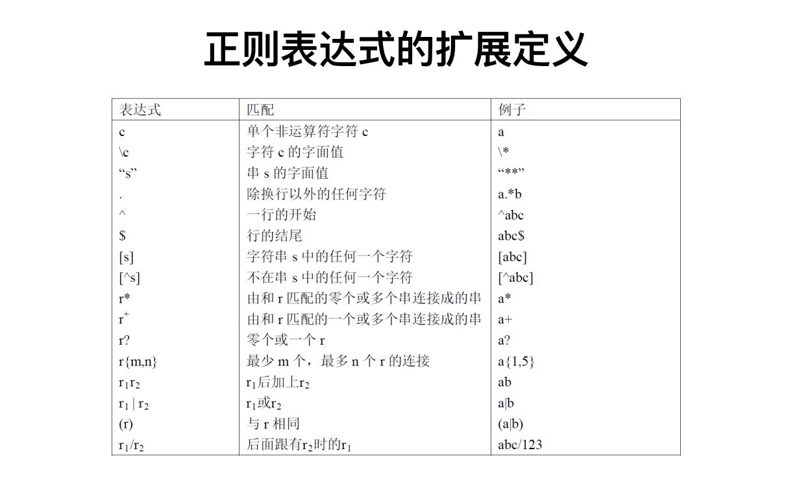

# 自然语言处理 

## 基于规则的自然语言处理方法

**自然语言分类：**

+ 分析型语言：词形变化很少，由虚词和词序表示词之间的语法关系，如汉语
+ 黏着型语言：有词形变化，词的语法意义由附加成分表示
+ 屈折型语言：有词形变化，词的语法意义由词的形态变化表示

**词法分析：**

+ 形态还原：将词还原成基本词型
+ 分词：识别出句子中的词
+ 命名实体识别：人名，地名，机构名
+ 词性标注：为句子中的词标上预定义类别集合（标注集）中的类

**词：**

+ 词是语言中最小的能独立运用的单位，也是语言信息处理的基本单位
+ 构词特点：
  + 曲折变化：词尾和词形变化，词性不变
  + 派生变化：加前缀和后缀，词性发生变化
  + 复合变化：多个单词以某种方式组合成一个词

**形态还原：**

+ 通用规则：变化有规律
+ 个性规则：变化无规律

**分词方法：**

+ 正向最大匹配或逆向最大匹配
+ 双向最大匹配
+ 正向最大、逆向最小匹配：发现组合型歧义
+ 逐词遍历匹配
+ 设立切分标记
+ 全切分

**正则表达式：**一种可以高效简洁地处理符号串的模式表示方法

